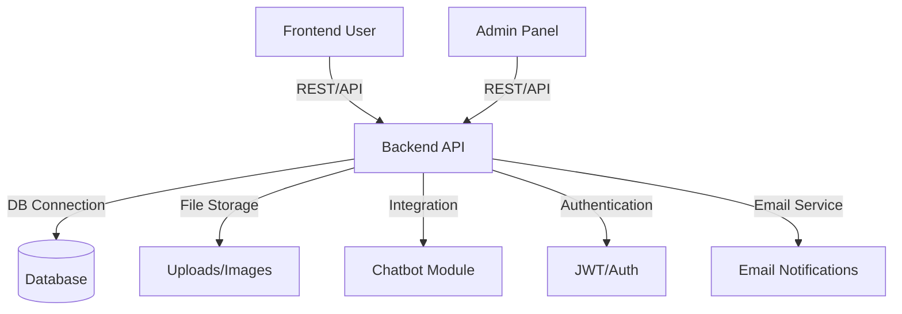

# ✨🍔🚀 LEARN.md – The Ultimate Guide to the Foodie Codebase 🍔🍕✨

## Table of Contents 📚🗺️👀

1. [Project Overview](#1-project-overview-)
2. [High-Level Architecture](#2-high-level-architecture-)
3. [Tech Stack Breakdown](#3-tech-stack-breakdown-)
4. [Folder-by-Folder Deep Dive](#4-folder-by-folder-deep-dive-)
5. [Contributor Pathways](#5-contributor-pathways-)
6. [Getting Started (Setup & Dev)](#6-getting-started-setup--dev-)
7. [Feature How-Tos (Front, Back, Admin, Chatbot)](#7-feature-how-tos-front-back-admin-chatbot-)
8. [API Documentation](#8-api-documentation-)
9. [Debugging, Testing, and Best Practices](#9-debugging-testing-and-best-practices-)
10. [Advanced Learning Resources](#10-advanced-learning-resources-)
11. [FAQ](#11-faq-)

---

## 1. Project Overview 🧑‍🍳📦💡

**Foodie** is a modern, open-source, full-stack food ordering application with a focus on scalability, modularity, and real-world learning. 🍽️🌍🛠️ It provides:

* A rich user-facing web app (frontend)
* A robust backend API (Node.js/Express)
* A dedicated admin panel
* Containerized, OSS-friendly workflows

Foodie aims to bridge the gap between beginner contributions and real-world production code, making it a playground for developers who want to upskill and ship. 🎓⚡🎯

**Live Demo:** [Coming Soon] | **Staging:** [Coming Soon]

---

## 2. High-Level Architecture 🏗️🖥️🔧



**Key Flows:** 🏃‍♂️🔀🌊

* **Frontend & Admin** communicate with backend via REST APIs
* **Backend** handles business logic, database operations, file uploads, and chatbot integration
* **Docker Compose** manages orchestration for local development and deployment
* **Authentication** flows through JWT tokens for secure access

---

## 3. Tech Stack Breakdown 🖥️🛠️🌈

| Layer        | Tech                                                            |
| ------------ | --------------------------------------------------------------- |
| Frontend     | Vite + React 18+                                               |
| Backend      | Node.js 18+, Express.js 4+                                     |
| Admin        | Vite + React 18+                                               |
| Database     | MongoDB with Mongoose ODM                                       |
| Authentication| JWT, bcrypt                                                    |
| File Storage | Multer (local), Cloudinary (production)                        |
| Container    | Docker, Docker Compose                                          |
| Linting      | ESLint, Prettier                                               |
| Testing      | Jest, React Testing Library                                     |
| Others       | Chatbot integration, Nodemailer, Socket.io                     |

*Want to confirm versions? Check `package.json` files in each folder!* 🤓🔍🗃️

---

## 4. Folder-by-Folder Deep Dive 📁🔎👓

### `/frontend` 🚦🌐🛋️

* **Purpose:** User-facing web application
* **Key Files:**
  * `src/components/`: Reusable React components
  * `src/pages/`: Main application pages
  * `src/hooks/`: Custom React hooks
  * `src/utils/`: Helper functions and utilities
  * `src/api/`: API service functions
  * `src/context/`: React Context providers
  * `public/`: Static assets
  * `index.html`: SPA entry point
  * `package.json`: Dependencies & scripts
  * `CHATBOT_FEATURE.md`: Guide to the built-in chatbot

* **Pro Tips:**
  * Use Vite for fast dev server and builds
  * Follow component composition patterns
  * Implement proper error boundaries
  * Use environment variables for API endpoints

### `/backend` 🛠️🧠📡

* **Purpose:** API server, business logic, database operations
* **Key Files:**
  * `server.js`: Application entry point
  * `routes/`: API endpoint definitions
  * `controllers/`: Business logic handlers
  * `models/`: Database schemas (Mongoose)
  * `middlewares/`: Authentication, validation, error handling
  * `utils/`: Helper functions
  * `config/`: Database and environment configuration
  * `uploads/`: Local file storage
  * `tests/`: API tests

* **Pro Tips:**
  * Follow MVC architecture pattern
  * Use async/await consistently
  * Implement proper error handling
  * Add comprehensive API documentation

### `/admin` 👩‍💼📊🎛️

* **Purpose:** Administrative dashboard for restaurant management
* **Key Files:**
  * Similar structure to frontend
  * `src/components/admin/`: Admin-specific components
  * `src/pages/dashboard/`: Dashboard views
  * `src/services/`: Admin API services

* **Pro Tips:**
  * Implement role-based access control
  * Create intuitive data visualization
  * Test all CRUD operations thoroughly

### `/images`, `/uploads` 🖼️📂📸

* Store static images, menu pictures, and user uploads
* Configured in `.gitignore` to exclude from version control
* Use cloud storage (Cloudinary) for production

### `.github/` 🐙⚙️📝

* GitHub Actions workflows for CI/CD
* Issue and PR templates
* Contributing guidelines

---

## 5. Contributor Pathways 🏁👣🌱

### How to pick your journey:

| Contributor Type     | Start Here                                    | Skills Needed        |
| -------------------- | --------------------------------------------- | -------------------- |
| Frontend Developer   | `/frontend`, UI/UX issues                     | React, CSS, API integration |
| Backend Developer    | `/backend`, API endpoints, database           | Node.js, Express, MongoDB |
| Admin Dashboard Dev  | `/admin`, management features                 | React, data visualization |
| Chatbot/AI Dev       | `CHATBOT_FEATURE.md`, integration            | API integration, NLP |
| DevOps/Docker        | Docker configs, deployment                    | Docker, CI/CD |
| QA/Testing          | Test coverage, bug fixes                      | Jest, testing frameworks |
| Documentation        | README updates, API docs                      | Technical writing |
| Full Stack          | Cross-component features                       | Multiple technologies |

### Finding issues: 🏷️🔎✨

* Look for labels: `good first issue`, `help wanted`, `documentation`, `bug`
* Check the project board for prioritized tasks
* Ask maintainers for guidance in discussions
* Review closed PRs for contribution examples

---

## 6. Getting Started (Setup & Dev) 🏃‍♂️💻⏩

### Prerequisites
* Node.js 18+ and npm/yarn
* Docker and Docker Compose (recommended)
* Git
* MongoDB (if running locally)

### Quick Start

1. **Clone the repository**
   ```bash
   git clone https://github.com/yourusername/Foodie.git
   cd Foodie
   ```

2. **Docker Setup (Recommended)**
   ```bash
   # Copy environment files
   cp .env.example .env
   cp frontend/.env.example frontend/.env
   cp backend/.env.example backend/.env
   
   # Start all services
   docker-compose up --build
   ```
   
   **Access Points:**
   - Frontend: http://localhost:3000
   - Backend API: http://localhost:5000
   - Admin Panel: http://localhost:3001
   - Database: localhost:27017

3. **Manual Setup (Development)**
   
   **Backend:**
   ```bash
   cd backend
   npm install
   npm run dev  # Uses nodemon for auto-reload
   ```
   
   **Frontend:**
   ```bash
   cd frontend
   npm install
   npm run dev  # Vite dev server
   ```
   
   **Admin:**
   ```bash
   cd admin
   npm install
   npm run dev
   ```

4. **Environment Configuration**
   ```bash
   # Backend .env
   NODE_ENV=development
   PORT=5000
   MONGODB_URI=mongodb://localhost:27017/foodie
   JWT_SECRET=your_jwt_secret_here
   
   # Frontend .env
   VITE_API_URL=http://localhost:5000/api
   VITE_SOCKET_URL=http://localhost:5000
   ```

---

## 7. Feature How-Tos (Front, Back, Admin, Chatbot) 🧩🔨🌟

### 🔹 **Frontend Development**

**Adding a new component:**
```javascript
// src/components/NewComponent.jsx
import React from 'react';
import './NewComponent.css';

const NewComponent = ({ prop1, prop2 }) => {
  return (
    <div className="new-component">
      {/* Component logic */}
    </div>
  );
};

export default NewComponent;
```

**API integration:**
```javascript
// src/api/apiService.js
const API_BASE = process.env.VITE_API_URL;

export const fetchMenuItems = async () => {
  const response = await fetch(`${API_BASE}/menu`);
  return response.json();
};
```

### 🔹 **Backend Development**

**Creating new API endpoints:**
```javascript
// routes/menu.js
const express = require('express');
const { getMenuItems, createMenuItem } = require('../controllers/menuController');
const auth = require('../middlewares/auth');

const router = express.Router();

router.get('/', getMenuItems);
router.post('/', auth, createMenuItem);

module.exports = router;
```

**Database models:**
```javascript
// models/MenuItem.js
const mongoose = require('mongoose');

const menuItemSchema = new mongoose.Schema({
  name: { type: String, required: true },
  price: { type: Number, required: true },
  category: { type: String, required: true },
  image: { type: String },
  createdAt: { type: Date, default: Date.now }
});

module.exports = mongoose.model('MenuItem', menuItemSchema);
```

### 🔹 **Admin Dashboard**

* Focus on data management interfaces
* Implement proper form validation
* Add confirmation dialogs for destructive actions
* Use charts and analytics components

### 🔹 **Chatbot Integration**

* Refer to `CHATBOT_FEATURE.md` for detailed implementation
* Extend conversation flows in backend logic
* Test different user scenarios

---

## 8. API Documentation 📋🔗📡

### Base URL
- Development: `http://localhost:5000/api`
- Production: `https://your-domain.com/api`

### Authentication
All protected routes require JWT token in header:
```
Authorization: Bearer <your_jwt_token>
```

### Core Endpoints

| Method | Endpoint | Description | Auth Required |
|--------|----------|-------------|---------------|
| POST | `/auth/register` | User registration | No |
| POST | `/auth/login` | User login | No |
| GET | `/menu` | Get menu items | No |
| POST | `/menu` | Create menu item | Yes (Admin) |
| GET | `/orders` | Get user orders | Yes |
| POST | `/orders` | Create new order | Yes |

*For complete API documentation, see `/docs` or Postman collection*

---

## 9. Debugging, Testing, and Best Practices 🧪📝🔬

### Code Quality
* **Linting:** Run `npm run lint` before commits
* **Formatting:** Use Prettier configuration
* **Testing:** Maintain >80% code coverage
* **Type Safety:** Consider TypeScript migration

### Testing Strategy
```bash
# Backend tests
cd backend
npm test              # Run all tests
npm run test:watch    # Watch mode
npm run test:coverage # Coverage report

# Frontend tests
cd frontend
npm test              # Jest + React Testing Library
npm run test:e2e      # End-to-end tests (if configured)
```

### Best Practices
* Write meaningful commit messages
* Keep PRs focused and small (<400 lines)
* Add JSDoc comments for functions
* Update documentation with feature changes
* Follow semantic versioning for releases

### Common Issues & Solutions
* **CORS errors:** Check backend CORS configuration
* **Environment variables:** Ensure all required vars are set
* **Database connection:** Verify MongoDB is running
* **Port conflicts:** Check if ports 3000, 5000, 3001 are available

---

## 10. Advanced Learning Resources 📚🧑‍💻🌐

### Essential Reading
* [Node.js Best Practices](https://github.com/goldbergyoni/nodebestpractices)
* [React Patterns](https://reactpatterns.com/)
* [Express.js Guide](https://expressjs.com/en/guide/)
* [MongoDB University](https://university.mongodb.com/)

### Development Tools
* [Postman](https://www.postman.com/) - API testing
* [MongoDB Compass](https://www.mongodb.com/products/compass) - Database GUI
* [React Developer Tools](https://react.dev/learn/react-developer-tools)
* [Docker Desktop](https://www.docker.com/products/docker-desktop/)

### Community & Support
* [Stack Overflow - MERN Stack](https://stackoverflow.com/questions/tagged/mern)
* [React Community Discord](https://discord.gg/react)
* [Node.js Community](https://nodejs.org/en/get-involved/)

---

## 11. FAQ ❓🗣️🙋‍♂️

**Q: Do I need Docker to contribute?**
A: No, but it's the fastest way to get all services running. You can run each service individually with npm commands. 💡🚄👍

**Q: How do I reset my local database?**
A: Run `docker-compose down -v` to remove volumes, then `docker-compose up --build` to restart fresh.

**Q: Where are the environment variables?**
A: Check for `.env.example` files in root, frontend, and backend folders. Copy and rename to `.env` with your values. 🧐📄🔑

**Q: How can I add new payment methods?**
A: Payment integration is in `backend/services/payment.js`. Follow the existing Stripe pattern for new providers.

**Q: How do I extend the chatbot?**
A: See `CHATBOT_FEATURE.md` for implementation details. Backend logic is in `backend/services/chatbot.js`. 🤖📄🆘

**Q: Can I use this project commercially?**
A: Check the LICENSE file for specific terms. Generally, open-source licenses allow commercial use with attribution.

**Q: How do I deploy this to production?**
A: See `DEPLOYMENT.md` for detailed production deployment guides for various platforms.

**Q: Who do I contact for help?**
A: Open a GitHub Discussion, comment on relevant issues, or join our Discord community. Everyone here started as a beginner! 💬🤝🌱

---

## 🚀 **Your Open Source Journey Starts Here!** 🌟🍽️🙌

Ready to contribute? Here's your action plan:

1. ⭐ **Star this repository**
2. 🍴 **Fork the project**  
3. 📥 **Clone your fork**
4. 🐳 **Run with Docker**
5. 🐛 **Find an issue to work on**
6. 💻 **Code your solution**
7. 🧪 **Test thoroughly**
8. 📝 **Submit a PR**

Dive in, ask questions, and help make Foodie better for everyone. The community grows stronger with each new contributor—let's build something delicious together! 🍕✨👏

