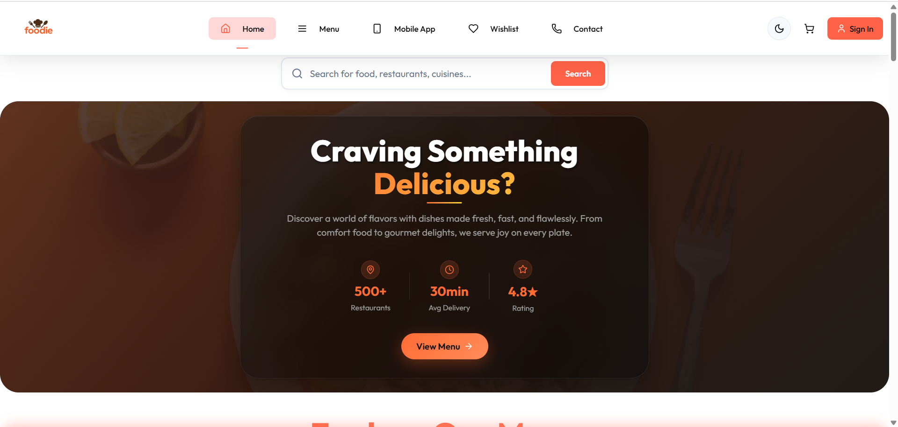
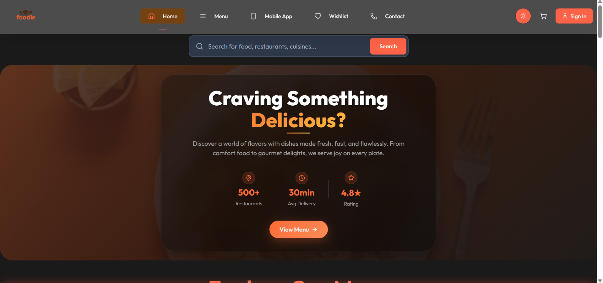
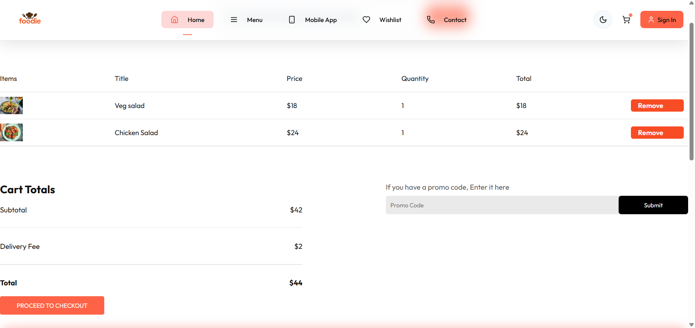
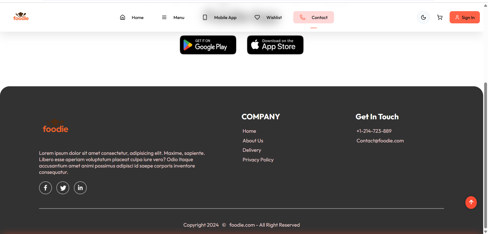
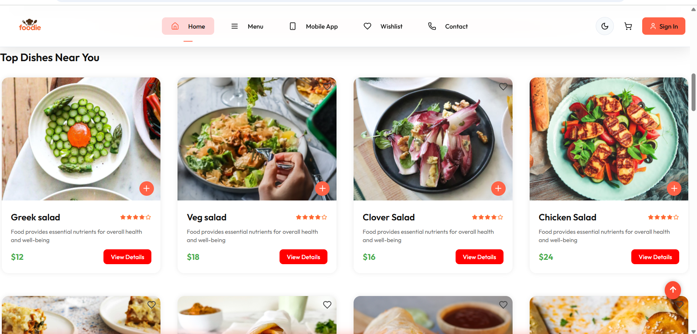
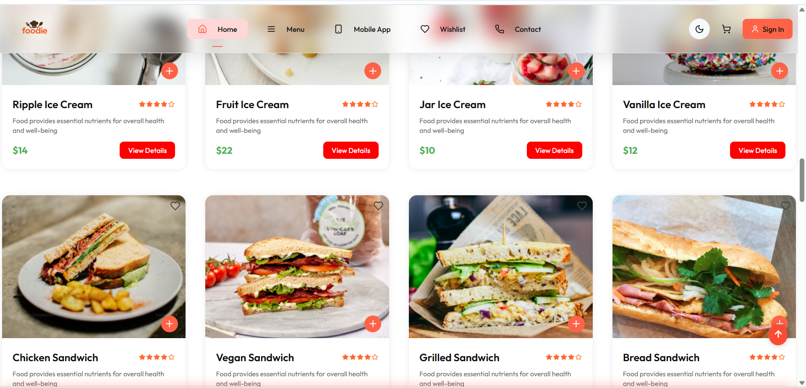
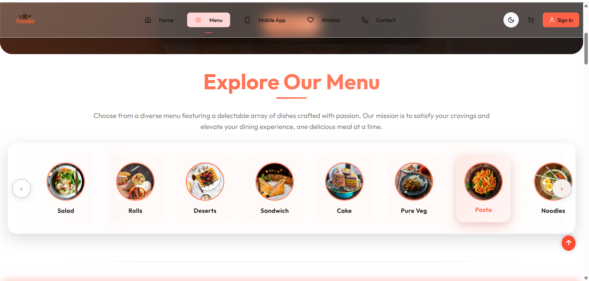
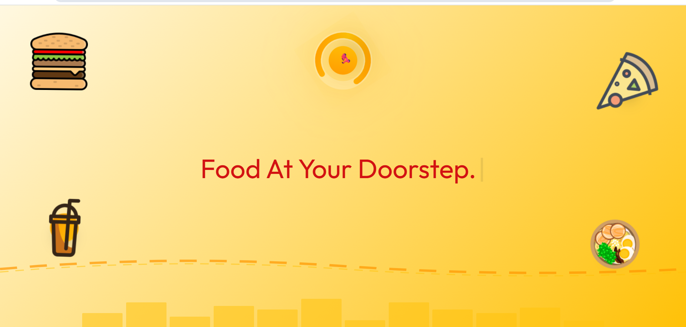
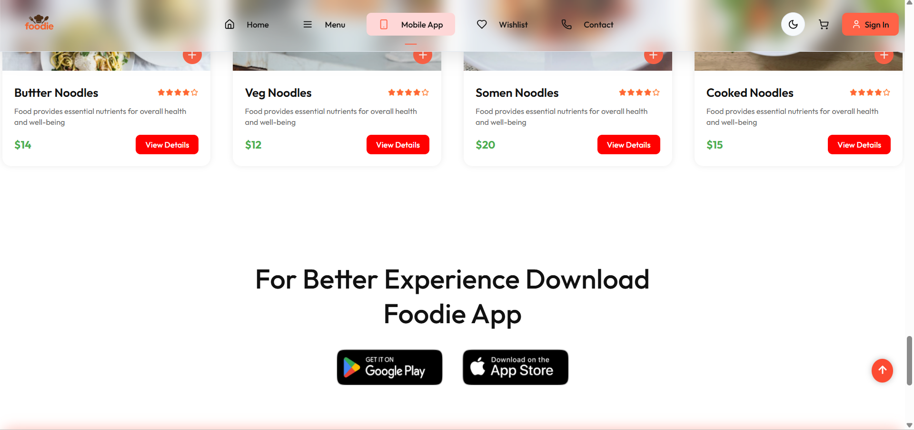

# 🍽️ Foodie — All Types of Food Available

A modern full-stack web application for browsing, ordering, and managing a wide variety of food items. Built using **React** (Frontend) and **Express.js** (Backend) with seamless MongoDB integration and rapid development tooling via **Vite**.

---


*<sup>Main homepage (Light Mode). Swap the image URL above for your own screenshot.</sup>*

---

## 📑 Table of Contents

- [🔧 Tech Stack](#-tech-stack)
  - [🖥️ Frontend](#️-frontend)
  - [🌐 Backend](#-backend)
- [✨ Key Features](#-key-features)
- [🌗 Dark Mode Support](#-dark-mode-support)
- [🚀 Getting Started](#-getting-started)
  - [Prerequisites](#prerequisites)
  - [📦 Installation](#-installation)
  - [🔧 Development Setup](#-development-setup)
  - [⚙️ Environment Variables](#-environment-variables)
- [🖼️ Demo Screenshots](#-demo-screenshots)
- [📁 Project Structure](#-project-structure)
- [🧪 Linting](#-linting)
- [🧰 Scripts](#-scripts)
- [📝 Notes](#-notes)
- [🤝 Contributing](#-contributing)
- [📄 License](#-license)
- [🙌 Acknowledgements](#-acknowledgements)

---

## 🔧 Tech Stack

### 🖥️ Frontend
- **React 18.3**
- **Vite** (super-fast build tool)
- **React Router DOM** (client-side routing)
- **GSAP** (animations)
- **ESLint** (code linting & style)

### 🌐 Backend
- **Node.js + Express**
- **MongoDB** with **Mongoose**
- **CORS + JSON Middleware**
- **dotenv** (for environment variables)
- **Razorpay** (payment gateway integration)

---

## ✨ Key Features

- 🥗 **Browse a wide variety of food items**
- 🛒 **Add items to cart and manage orders**
- 🖤 **Wishlist and user authentication**
- 🔄 **Switch between light and dark mode**
- 💳 **Online payment (Razorpay)**
- 📱 **Mobile responsive UI**
- 🍴 **Modern, extensible design**

---

## 🌗 Dark Mode Support


*<sup>Example: Toggle between Light and Dark Modes using the switch in the UI.</sup>*

---

## 🚀 Getting Started

### Prerequisites

- **Node.js** (v16 or above)
- **npm** or **yarn**
- **MongoDB** locally or remote (e.g., [MongoDB Atlas](https://www.mongodb.com/cloud/atlas))

---

### 📦 Installation

```bash
git clone https://github.com/your-username/foodie.git
cd foodie
```

---

#### Frontend

```bash
cd frontend
npm install
npm install gsap
npm run dev
```

---

#### Backend

In another terminal, from the project root:

```bash
cd backend 
npm install
npm install dotenv
```

---

### ⚙️ Environment Variables

Create a `.env` file in your `backend` directory with the following:

```env
MONGODB_URI=your_mongodb_connection_string
RAZORPAY_KEY_ID=your_razorpay_key_id
RAZORPAY_KEY_SECRET=your_razorpay_key_secret
```

---

### 🔧 Development Setup

**Start Backend:**

```bash
node server.js
```

> Backend runs at [`http://localhost:4000`](http://localhost:4000)

**Start Frontend:**

```bash
npm run dev
```

> Frontend typically runs at [`http://localhost:5173`](http://localhost:5173)

---

## 🖼️ Demo Screenshots

| Cart Page | Contact | Delivery Info | Dishes |
|-----------|---------|---------------|--------|
|  |  |  |  |

| Dishes 2 | Explore Menu | Landing Page | Mobile App |
|----------|--------------|--------------|------------|
|  |  |  |  |

---

## 📁 Project Structure

```
├── public/
├── frontend/
│   ├── src/
│   │   ├── components/
│   │   ├── pages/
│   │   └── main.jsx
│   └── ...
├── backend/
│   ├── server.js
│   ├── routes/
│   │   └── foodRoute.js
│   ├── config/
│   │   └── db.js
│   └── ...
├── docs/
│   └── images/
├── vite.config.js
├── eslint.config.js
├── package.json
└── README.md
```

---

## 🧪 Linting

ESLint is pre-configured for React and Hooks.

```bash
npm run lint
```

---

## 🧰 Scripts

| Command             | Description                      |
|---------------------|----------------------------------|
| `npm run dev`       | Start Vite development server    |
| `npm run build`     | Build frontend for production    |
| `npm run preview`   | Preview production build         |
| `npm run lint`      | Run ESLint checks                |
| `node server.js`    | Start backend server             |

---

## 📝 Notes

- Ensure **MongoDB** is running locally or update `MONGODB_URI` in your `.env` file.
- Backend and frontend run as separate servers. Use the correct ports as needed.
- You can update API routes via `routes/foodRoute.js` (backend).
- Payment integration requires valid Razorpay credentials.

---

## 🤝 Contributing

We welcome contributions!

- ⭐ **Star this repository** to show support.
- 🐛 **Report bugs** or **suggest features** through issues.
- 🔧 **Submit pull requests** for improvements.
- 📖 **Help improve documentation.**

> For detailed contribution steps, see [CONTRIBUTING.md](CONTRIBUTING.md).

---

## 📄 License

This project is licensed under the [MIT License](LICENSE).

---

## 🙌 Acknowledgements

- [React](https://reactjs.org/)
- [Vite](https://vitejs.dev/)
- [Express](https://expressjs.com/)
- [MongoDB](https://www.mongodb.com/)
- [Razorpay](https://razorpay.com/)

